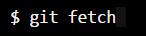
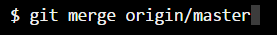
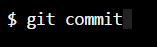
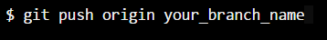

# CS2001 - Level 2 Group Project Coursework - Team 14
------------------------------------------------------

_Information about our project can be found here._

Tasks appointed to us during our last meeting on 19/10/2016:
- Get new member of our group added to our Whatsapp group chat.  
- Work on git to get used to it.

------------------------------------
READ THIS BEFORE MAKING CHANGES TO THE PROJECT
------------------------------------

If you already have cloned the project to your local drive then you need to follow these steps
to avoid merge conflicts (when two or more people are working on the project at the same time
and editing the same line or do similar activities). 

1. Fetch and merge changes from the remote  
    
   	
2. Create a branch to work on a new project feature 
    
3. Develop the feature on your branch and commit your work 
   
4. Fetch and merge from the remote again  
(in case new commits were made while you were working  
but only merge if there's new changes from the github repository)  
    
    
5. Push your branch up to the remote for review  
    
